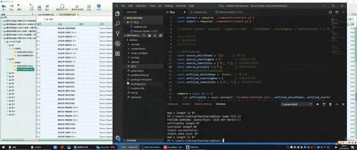

# What is it?
  It's a nodejs script which automates cleaning and sorting data, then filling them in the right place. Also it automates both generating order forms and uploading them to StateGrid app.

# Why?
  Actually this is my best friend's idea. He is really tired of manually sorting a *HUGE* amount of asymmetric and error-prone data, which then have to be mannually typed in the right place inside StateGrid app. The data is a mess, their order is not the same as StateGrid asked, they have punctuation ambiguity， and missing datum which create holes in the columns. He can't do coding, so i help him implementing it. 

# TODOS:
- After a series of bug fixing, the script works very well, but it still lacks a decent interface. You have to change parameters inside the code. 
- The script uses Robot.js, and it depends on node-pre-gyp, which is incredibly complex to setting up its environment. So my next goal is to automate the deploying process too.
- It still needs some easy manual copying and resizing, but I would like to use windows api to automate those stuff too.

# WORKFLOWS:
1. upload items.sgcc -> StateGrid    ----M
2. copy generated empty sheets from StateGrid -> ./srcData/unfilled.xlsx   -----M
3. run the fill.js to auto compare between sourcePriceList.xlsx with unfilled.xlsx, then it'll fill the data into StateGird according to their diff map  --fill.js 
4. copy the auto filled sheet from StateGrid -> ./srcData/filled.xlsx    -----M
5. run generate.js to read every row from filled.xlsx, and generate $fileName.xlsx for each row.    ---generate.js (package)
6. run upload.js to auto upload every $fileName.xlsx to StateGrid app ---upload.js

<!--

## 源数据包.sgcc -》 导入投标工具 // --手工操作
## 复制投标工具里的新表格至 -》daDiao/srcData/unfilled.xlsx // --手工操作
复制 源报价表 -》daDiao/srcData/source.xlsx -》 把不含税单价 -》 根据 特征码(source vs unfilled) 调整顺序 -》自动填入入投标工具 // --fill.js
投标工具自动依据单价生成 -》税后单价 & 税后总价 -》新表格
## 复制投标工具里的新表格至 -》filled.xlsx // --手工操作
根据 filled.xlsx 中  每包的 每行的 序号，数量，税后单价，税后总价 -》来生成 单价分析表（文件名为 $序号.xlsx） (按包名来分文件夹)  // --generate.js
按 单价分析表 文件名 的顺序 自动上传 // --upload.js

-->
